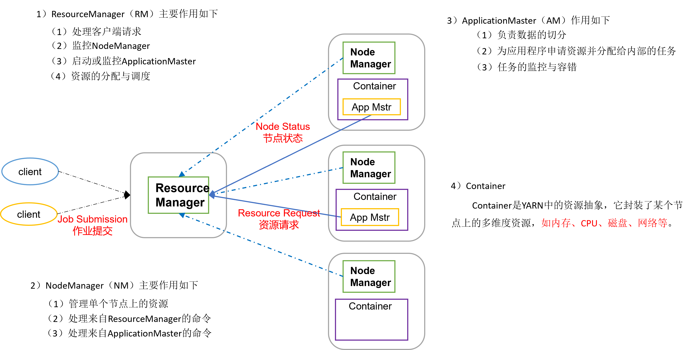
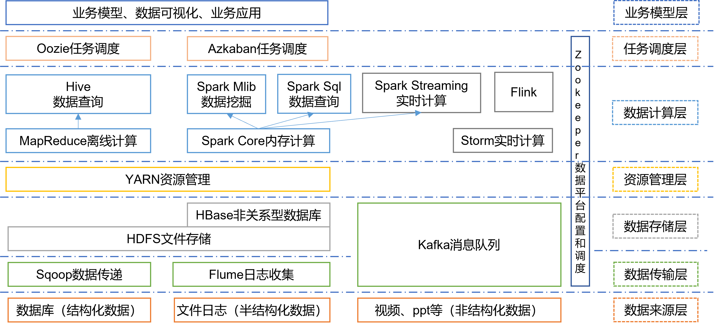

# Hadoop集群搭建

## 1 大数据概论

- 大数据特点（4V）：Volume，Velocity，Variety，Value
- 数据应用场景：物流仓库，零售，旅游，商品广告推荐，保险，金融，房产，人工智能。

- 大数据部门组织结构:

  平台组：Hadoop、Flume、Kafka、HBase、Spark等框架平台搭建；集群性能监控；集群性能调优。

  数据仓库组：ETL工程师（数据清洗）；数据分析，数据仓库建模。

  实时组：实时指标分析，性能调优。

  数据挖掘组：算法工程师；推荐系统工程师；用户画像工程师。

  报表开发组：JavaEE工程师，前端工程师。

---

## 2 从Hadoop框架讨论大数据生态

> Hadoop是一个由Apache基金会所开发的分布式系统基础架构。主要解决海量数据的存储和海量数据的分析计算问题。

Gooogle在大数据方面上的三篇论文：GFS(HDFS)、Map-Reduce（MR）、BigTable（HBase）

### 2.1 Hadoop三大发行版本

Hadoop三大发行版本：Apache、Cloudera、Hortonworks。

​	Apache版本最原始（最基础）的版本，对于入门学习最好。

​	Cloudera内部集成了很多大数据框架。对应产品CDH。

​	Hortonworks文档较好。对应产品HDP。

### 2.2 Hadoop的优势（4高）

高可靠性：Hadoop底层维护多个数据副本，所以即使Hadoop某个计算元素或存储出现故障，也不会导致数据的丢失。

高扩展性：再集群间分配任务数据，可方便的扩展数以千记的节点。

高效性：再MapReduce的思想下，Hadoop是并行工作的，以加快任务处理速度。

高容错性：能够自动将失败的任务重新分配。  

### 2.3 Hadoop组成（面试重点）

> Hadoop1.X和Hadoop2.X的区别：

Hadoop1.X：MapReduce（计算+资源调度）、HDFS（数据存储）、Common（辅助工具）

Hadoop2.X: MapReduce(计算)、Yarn(资源调度)、HDFS（数据存储)、Common（辅助工具)

在Hadoop1.X时代Hadoop中的MapReduce同时处理业务逻辑运算和资源的调度，耦合性较大。在Hadoop2.X时代，增加了Yarn。Yarn只负责资源的调度，Map Reduce只负责运算。

#### 2.3.1 HDFS架构概述

> HDFS架构概述

1. NameNode（nn）：存储文件的元数据，如文件名，文件目录结构，文件属性(生成时间，副本数，文件权限)，以及每个我文件的块列表和块所在的DataNode。
2. DataNode（dn）：在本地文件系统存储文件块数据，以及块数据的校验和。
3.  SecondayNameNode（2nn）：每隔一段时间堆NameNode元数据备份。

#### 2.3.2 YARN架构概述

> Hadoop的组成部分，主要负责资源调度

- ResourceManager（rm）:统筹管理每一台机器上的资源，并且负责接收处理客户端作业请求。 
- NodeManager（nm）:负责单独每一台机器的资源管理，实时保证和大哥ResourceManager）通信。
- ApplicationMaster：针对每个请求job的抽象封装
-  Container：将来运行在YARN上的每一个任务都会给其分配资源， Container就是当前任务所需资源的抽象封装




#### 2.3.3 MapReduce架构概述

MapReduce将计算过程分为两个阶段：Map和Reduce

1）Map阶段并行处理输入数据

2）Reduce阶段对Map结果进行汇总

- MapReduce（hadoop的组成部分，主要负责数据的计算分析）	
     - Map阶段：就是把需要计算的数据按照需求分成多个MapTask任务来执行
     - Reduce阶段: 把Map阶段处理完的结果拷贝过来根据需求进行汇总计算

### 2.4 大数据技术生态体系



图中涉及的技术名词解释如下：

1）Sqoop：Sqoop是一款开源的工具，主要用于在Hadoop、Hive与传统的数据库（MySql）间进行数据的传递，可以将一个关系型数据库（例如 ：MySQL，Oracle 等）中的数据导进到Hadoop的HDFS中，也可以将HDFS的数据导进到关系型数据库中。

2）Flume：Flume是一个高可用的，高可靠的，分布式的海量日志采集、聚合和传输的系统，Flume支持在日志系统中定制各类数据发送方，用于收集数据； 

3）Kafka：Kafka是一种高吞吐量的分布式发布订阅消息系统； 

4）Spark：Spark是当前最流行的开源大数据内存计算框架。可以基于Hadoop上存储的大数据进行计算。

5）Flink：Flink是当前最流行的开源大数据内存计算框架。用于实时计算的场景较多。

6）Oozie：Oozie是一个管理Hdoop作业（job）的工作流程调度管理系统。

7）Hbase：HBase是一个分布式的、面向列的开源数据库。HBase不同于一般的关系数据库，它是一个适合于非结构化数据存储的数据库。

8）Hive：Hive是基于Hadoop的一个数据仓库工具，可以将结构化的数据文件映射为一张数据库表，并提供简单的SQL查询功能，可以将SQL语句转换为MapReduce任务进行运行。 其优点是学习成本低，可以通过类SQL语句快速实现简单的MapReduce统计，不必开发专门的MapReduce应用，十分适合数据仓库的统计分析。

9）ZooKeeper：它是一个针对大型分布式系统的可靠协调系统，提供的功能包括：配置维护、名字服务、分布式同步、组服务等。

### 2.5 推荐系统框架图


---

## 3 Hadoop运行环境搭建

### 3.1 准备模板虚拟机(最小化安装)

1. 修改用户名,将用户名修改为`hadoop101`

```shell
vi /etc/hostname
```

需要重启后才能生效，重启命令：`reboot`

2. 根据VMware修改为静态IP

```shell
vi /etc/sysconfig/network-scripts/ifcfg-ens33
```

>  注 网络配置文件名可能会有不同，在输入到ifcfg时，可以连续按两下tab键，获取提示，比如我的机器 为 ifcfg-ens33

需要或修改内容替换如下：

```
BOOTPROTO=”static” #静态连接 
ONBOOT=”yes” #网络设备开机启动 
IPADDR=”192.168.130.101” #192.168.130.x, x为3~255. 
NETMASK=”255.255.255.0” #子网掩码 
GATEWAY=”192.168.130.2” #网关IP 需要虚拟机网络设置里的网关进行设置
DNS1= 8.8.8.8
DNS2=8.8.8.4
```

需要重新启动网络服务

```shell
service network restart
```

最后对网络进行测试，并可用Xshell进行远程连接

```
ping www.baidu.com
```

3. 通过yum安装必要的软件

```shell
yum install -y epel-release
yum install -y psmisc nc net-tools rsync vim lrzsz ntp libzstd openssl-static tree iotop git
```

此时就可以用vim进行编辑了

4. 关闭防火墙

```shell
systemctl stop firewalld      #暂时关闭防火墙
systemctl disable firewalld   #永久关闭防火墙

systemctl status firewalld    #查看防火墙状态
```

5. 修改hosts文件（为搭建集群做准备）

```shell
vim /etc/hosts
```

将hosts文件修改为集群对应的host。[host文件](./hosts.txt)

6. 创建普通用户并且提升它能拥有root权限

创建普通用户：

```shell
useradd xu1an
passwd xu1an  
#然后设置密码 123456
```

  配置root权限

```shell
vim /etc/sudoers
```

打开`sudoers`文件后，在`root`下方添加

```shell
xu1an ALL=(ALL) NOPASSWD:ALL
```

7. 在/opt目录下创建 `software `和` module`

software: 放置软件安装包

module: 放置软件安装目录

```shell
cd /opt
mkdir software
mkdir module
```

8. 将software 和 module 目录的所有者和所属组修改为` xu1an`

```shell
chown xu1an:xu1an /module /software
```

### 3.2 准备hadoop102 机器（通过克隆模板机的方式创建）

1. 修改主机名，将名称修改为`hadoop102`

```shell
vim /etc/hostname
```

2. 修改IP地址

```shell
vim /etc/sysconfig/network-scripts/ifcfg-ens33
```

修改ip

```shell
IPADDR=”192.168.130.102” #将ip修改为102
```

通过`reboot`重启linux

### 3.3 在hadoop102上安装jdk

1. 将jdk的安装包上传到 /opt/software 下

通过Xftp将jdk和hadoop导入到/opt/software下

2. 将jdk安装到 /opt/module 下

```shell
tar -zxvf jdk-8u212-linux-x64.tar.gz -C ../module/
```

> **补充**
>
> 压缩命令：tar -zcvf 压缩文件名 .tar.gz 被压缩文件名
>
> - 可先切换到当前目录下，压缩文件名和被压缩文件名都可加入路径。
>
> ---
>
> 解压缩命令： tar -zxvf 压缩文件名.tar.gz
>
> - 解压缩后的文件只能放在当前的目录。
> - C代表change目录的意思，指定解压文件到/opt/module这个目录下

3. 配置jdk的环境变量

可查看/etc/profile文件，linux建议在/etc/profile.d下创建*.sh。而不是在profile内部直接修改

 在/etc/profile.d 目录下创建自定的配置文件 my_env.sh

```shell
cd /etc/profile.d/
sudo touch my_env.sh
sudo vim my_env.sh
```

> **补充**
>
> Linux sudo命令以系统管理者的身份执行指令

`my_env.sh`中编写JDK环境变量：

```shell
#配置JDK的环境变量
#声明JAVA_HOME变量
JAVA_HOME=/opt/module/jdk1.8.0_212
#声明PATH变量，在系统原有PATH上追加
PATH=$PATH:$JAVA_HOME/bin

#提升PATA JAVA_HOME 为系统全局变量
export JAVA_HOME PATH 
```

### 3.3 在hadoop102上安装hadoop

1. 将hadoop安装到 /opt/module 下

```shell
tar -zvxf hadoop-3.1.3.tar.gz -C ../module/
```

2. 配置hadoop的环境变量

```shell
cd /etc/profile.d
sudo vim my_env.sh
```

在`my_env.sh`中配置如下内容

```shell
#声明JAVA_HOME变量
JAVA_HOME=/opt/module/jdk1.8.0_212

#声明HADOOP_HOME变量
HADOOP_HOME=/opt/module/hadoop-3.1.3

#将JAVA_HOME变量追加到PATH变量上
#将HADOOP_HOME/bin 、HADOOP_HOME/sbin 追加到PATH变量上
PATH=$PATH:$JAVA_HOME/bin:$HADOOP_HOME/bin:$HADOOP_HOME/sbin

#提升JAVA_HOME、PATH、HADOOP_HOME 变量为系统变量,
export JAVA_HOME PATH HADOOP_HOME
```

### 3.4 Hadoop的目录结构的了解

  重要目录
（1）bin目录：存放对Hadoop相关服务（HDFS,YARN）进行操作的脚本
（2）etc目录：Hadoop的配置文件目录，存放Hadoop的配置文件
（3）lib目录：存放Hadoop的本地库（对数据进行压缩解压缩功能）
（4）sbin目录：存放启动或停止Hadoop相关服务的脚本
（5）share目录：存放Hadoop的依赖jar包、文档、和官方案例

---

## 4 Hadoop运行模式 

Hadoop运行模式包括：本地模式、伪分布式模式以及完全分布式模式。

Hadoop官方网站：http://hadoop.apache.org/

Hadoop的运行模式介绍:

- 本地模式 

  hadoop默认安装后启动就是本地模式，就是将来的数据存在Linux本地，并且运行MR程序的时候也是在本地机器上运行

- 伪分布式模式

  伪分布式其实就只在一台机器上启动HDFS集群，启动YARN集群，并且数据存在HDFS集群上，以及运行MR程序也是在YARN上运行，计算后的结果也是输出到HDFS上。本质上就是利用一台服务器中多个java进程去模拟多个服务

- 完全分布式

  完全分布式其实就是多台机器上分别启动HDFS集群，启动YARN集群，并且数据存在HDFS集群上的以及运行MR程序也是在YARN上运行，计算后的结果也是输出到HDFS上。

### 4.1 本地运行模式

本地运行模式（官方wordcount）-- 入门（Hadoop的默认的运行模式）

**任务：统计文本中单词出现次数**

1. 在`hadoop-3.1.3`文件目录下面创建一个wcinput的文件

```shell
mkdir wcinput
```

2. 在`wcinput`下创建一个`word.txt`文件

```shell
cd wcinput
vim word.txt #或者touch word.txt
```

在文件中输入一些文字内容

3. 回到`hadoop-3.1.3`文件目录下，执行程序

```shell
hadoop jar share/hadoop/mapreduce/hadoop-mapreduce-examples-3.1.3.jar wordcount ./wcinput ./wcoutput
```

4. 查看结果

```
cat wcoutput/part-r-00000
```

### 4.2 完全分布式模式

> 准备工作：
>
> 1. 准备三台客户机（静态ip、主机名称）
> 2. 安装JDK，Hadoop，并配置环境变量
> 3. 配置集群
> 4. 单点启动
> 5. 配置ssh
> 6. 群起并测试集群

#### 4.2.1 准备三台虚拟机

准备完全分布式需要的机器: hadoop102  hadoop103  hadoop104

将克隆出来的虚拟机修改静态ip，主机名称。[见 3.2](#3.2 准备hadoop102 机器（通过克隆模板机的方式创建）)

#### 4.2.2 编写集群分发脚本my_rsync

##### scp（secure copy）安全拷贝

- 定义：scp可以实现服务器与服务器之间的数据拷贝

- 基本语法:

```
scp  -r   $pdir/$fname          $user@hadoop$host:$pdir/$fname
命令 递归   要拷贝的文件路径/名称     目的用户@主机:目的路径/名称
```

- 案例实操

前提：在`hadoop102` `hadoop103` `hadoop104` 都创建好的`/opt.module` `/opt/software`两个文件目录，并且已经把这两个目录修改为`xu1an：xu1an `

```shell
sudo chown xu1an:xu1an -R /opt/module /opt/software
```

- 特点：完全拷贝内容，不做任何比较，如果目的地已有相关内容，它会进行覆盖

1. 将`hadoop102`的数据（jdk、hadoop安装目录同步，环境变量文件）同步到 `hadoop103` `hadoop104`

   （注意需要移除`/opt/module/hadoop-3.1.3/share`下的`doc`文件，由于doc文件较大)

   ```shell
   cd /opt/module/hadoop-3.1.3/share
   rm -rf doc
   ```

2. 集群分发

   - a. 将`hadoop102` 上`/opt/module` 所有目录拷贝到 `hadoop103`的`/opt/module`

     ```shell
     scp -r ./* xu1an@hadoop103:/opt/module
     ```

   - b. 在`hadoop104`上执行：将`hadoop102`的内容 拉取到`hadoop104`的指定位置

     ```shell
     scp -r xu1an@hadoop102:/opt/module/jdk1.8.0_212 /opt/module/
     ```

   - c.在`hadoop103`上执行：将`hadoop102`的内容 发送给 `hadoop104`

     ```shell
     scp -r xu1an@hadoop102:/opt/module/hadoop-3.1.3 xu1an@hadoop104:/opt/module
     ```

##### rsync远程同步工具

rsync主要用于备份和镜像。具有速度快、避免复制相同内容和支持符号链接的优点。

rsync和scp区别：用rsync做文件的复制要比scp的速度快，rsync只对差异文件做更新。scp是把所有文件都复制过去。

- 基本语法:

```shell
rsync   -av      $pdir/$fname        $user@hadoop$host:$pdir/$fname
 命令  参数选项  要拷贝的文件路径/名称       目的用户@主机:目的路径/名称  
```

- 选项参数说明

| 选项 |     功能     |
| :--: | :----------: |
|  -a  |   归档拷贝   |
|  -v  | 显示复制过程 |

- 特点：速度快，不会对重复文件进行拷贝

a. 将`hadoop102 `上的`/opt/software/jdk-8u212-linux-x64.tar.gz `同步给` hadoop103`

```shell
rsync -av /opt/software/jdk-8u212-linux-x64.tar.gz xu1an@hadoop103:/opt/software/
```

b. 将`hadoop102 `上的`/opt/software/*`同步给` hadoop103`

```
rsync -av /opt/software/* xu1an@hadoop103:/opt/software
```

c.在`hadoop104`上主动向`hadoop102`拉取`/opt/software/*`

```shell
rsync -av xu1an@hadoop102:/opt/software/* /opt/software/
```

**注意：**rsync 限制同步数据的时候只能有两台机器进行通信。（不能通过第三台机器进行同步数据）

##### 集群分发脚本

- 需求：循环复制文件到所有节点的相同目录下

- 说明：在`/home/xu1an/bin`这个目录下存放的脚本，`xu1an`用户可以在系统任何地方直接执行

1. 在`/home/xu1an/bin`目录下创建`my_rsync文件`

   ```shell
   #可以用echo $PATH查看系统变量
   cd /home/xu1an #此时该目录下并无bin目录，需要创建bin
   echo $PATH #可以发现Linux系统在创建xu1an用户后，为用户添加了/home/xu1an/bin系统变量地址
   mkdir bin
   cd bin
   touch my_rsync
   chmod 744 my_rsync.sh #更改文件权限
   ```

2. 在该文件编写如下代码

   ```shell
   #!/bin/bash
   
   #参数预处理
   if [ $# -lt 1 ]
   then
    echo "参数不能为空!!!"
    exit
   fi
   
   #遍历集群中的机器一次分发内容
   for host in hadoop103 hadoop104
   do
     echo "===============$host================"
     #依次分发内容
     for file in $@
     do
      #判断当前文件是否存在
       if [ -e $file ]
       then
        #存在
         #1.获取当前文件目录结构
         pdir=$(cd -P $(dirname $file);pwd)
         #2.获取当前文件名
         fname=$(basename $file)
         #3. 登录目标机器，创建统一的目录结构
         ssh $host "mkdir -p $pdir"
         #4.依次把要分发的文件或者目录进行分发
         rsync -av $pdir/$fname $host:$pdir
       else
        #不存在
        echo "$file文件不存在!!!"
        exit
       fi
     done
   done
   ```

   测试分发脚本

   ```shell
   my_rsync /home/xu1an/bin/my_rsnyc.sh
   ```

   3. 集群分发`/etc/profile.d/my_env.sh`

      由于etc目录下需要root用户权限才能操作。在`hadoop102`中分发`my_env.sh`到`hadoop103`

      ```shell
      scp -r /etc/profile.d/my_env.sh root@hadoop103:/etc/profile.d  #输入root用户的密码
      ```

      在`hadoop103`中需要激活该脚本

      ```shell
      source /etc/profile
      ```

      查看是否生效

      ```shell
      java -version
      hadoop version
      ```

### 4.3 hadoop集群部署配置

#### 4.3.1 集群部署规划

		hadoop102    namenode           datanode    nodemanager
		
		hadoop103    resourcemanager    datanode    nodemanager
		 
		hadoop104    secondarynamenode  datanode    nodemanager

注意：`NameNode`和`SecondaryNameNode`不要安装在同一台服务器

注意：`ResourceManager`也很消耗内存，不要和`NameNode`、`SecondaryNameNode`配置在同一台机器上。

|      |     hadoop102      |          hadoop103           |          hadoop104          |
| ---- | :----------------: | :--------------------------: | :-------------------------: |
| HDFS | NameNode  DataNode |           DataNode           | SecondaryNameNode  DataNode |
| YARN |    NodeManager     | ResourceManager  NodeManager |         NodeManager         |

#### 4.3.2 配置文件说明

Hadoop配置文件分两类：默认配置文件和自定义配置文件，只有用户想修改某一默认配置值时，才需要修改自定义配置文件，更改相应属性值。

（1）默认配置文件：

| 要获取的默认文件     | 文件存放在Hadoop的jar包中的位置                           |
| -------------------- | --------------------------------------------------------- |
| [core-default.xml]   | hadoop-common-3.1.3.jar/core-default.xml                  |
| [hdfs-default.xml]   | hadoop-hdfs-3.1.3.jar/hdfs-default.xml                    |
| [yarn-default.xml]   | hadoop-yarn-common-3.1.3.jar/ yarn-default.xml            |
| [mapred-default.xml] | hadoop-mapreduce-client-core-3.1.3.jar/mapred-default.xml |

（2）自定义配置文件：

​    `core-site.xml`、`hdfs-site.xml`、`yarn-site.xml`、`mapred-site.xml`四个配置文件存放在`$HADOOP_HOME/etc/hadoop`这个路径上，用户可以根据项目需求重新进行修改配置。

- hadoop-env.sh (主要映射jdk的环境变量)（可以不配）

- core-site.xml （配置hadoop的全局信息）

- hdfs-site.xml

- mapread-site.xml

- yarn-site.xml

**注意：Hadoop 中加载配置文件的顺序**

​	当Hadoop集群启动后，先加载默认配置，然后再加载自定义配置文件，自定义的配置信息会覆盖默认配置。

（3）常用端口号说明

|         Daemon          |             App              |   Hadoop2   | Hadoop3 |
| :---------------------: | :--------------------------: | :---------: | :-----: |
|      NameNode Port      |     Hadoop HDFS NameNode     | 8020 / 9000 |  9820   |
|                         | Hadoop HDFS NameNode HTTP UI |    50070    |  9870   |
| Secondary NameNode Port |      Secondary NameNode      |    50091    |  9869   |
|                         |  Secondary NameNode HTTP UI  |    50090    |  9868   |
|      DataNode Port      |   Hadoop HDFS DataNode IPC   |    50020    |  9867   |
|                         |     Hadoop HDFS DataNode     |    50010    |  9866   |
|                         | Hadoop HDFS DataNode HTTP UI |    50075    |  9864   |

####  4.3.3 配置集群

（1）核心配置文件

配置`core-site.xml`

```shell
cd $HADOOP_HOME/etc/hadoop
vim core-site.xml
```

文件内容如下：

```xml
<?xml version="1.0" encoding="UTF-8"?>
<?xml-stylesheet type="text/xsl" href="configuration.xsl"?>

<configuration>
	<!-- 指定NameNode的地址 -->
    <property>
        <name>fs.defaultFS</name>
        <value>hdfs://hadoop102:9820</value>
</property>
<!-- 指定hadoop数据的存储目录 -->
    <property>
        <name>hadoop.tmp.dir</name>
        <value>/opt/module/hadoop-3.1.3/data</value>
</property>

<!-- 配置HDFS网页登录使用的静态用户为xu1an -->
    <property>
        <name>hadoop.http.staticuser.user</name>
        <value>xu1an</value>
</property>

<!-- 配置该xu1an(superUser)允许通过代理访问的主机节点 -->
    <property>
        <name>hadoop.proxyuser.xu1an.hosts</name>
        <value>*</value>
</property>
<!-- 配置该xu1an(superUser)允许通过代理用户所属组 -->
    <property>
        <name>hadoop.proxyuser.xu1an.groups</name>
        <value>*</value>
</property>
<!-- 配置该xu1an(superUser)允许通过代理的用户-->
    <property>
        <name>hadoop.proxyuser.xu1an.groups</name>
        <value>*</value>
</property>

</configuration>
```

（2）HDFS配置文件

配置`hdfs-site.xml`

```shell
vim hdfs-site.xml
```

文件内容如下：

```xml
<?xml version="1.0" encoding="UTF-8"?>
<?xml-stylesheet type="text/xsl" href="configuration.xsl"?>

<configuration>
	<!-- nn web端访问地址-->
	<property>
        <name>dfs.namenode.http-address</name>
        <value>hadoop102:9870</value>
    </property>
	<!-- 2nn web端访问地址-->
    <property>
        <name>dfs.namenode.secondary.http-address</name>
        <value>hadoop104:9868</value>
    </property>
</configuration>
```

（3）YARN配置文件

配置`yarn-site.xml`

```shell
vim yarn-site.xml
```

文件内容如下：

```xml
<?xml version="1.0" encoding="UTF-8"?>
<?xml-stylesheet type="text/xsl" href="configuration.xsl"?>

<configuration>
	<!-- 指定MR走shuffle -->
    <property>
        <name>yarn.nodemanager.aux-services</name>
        <value>mapreduce_shuffle</value>
</property>
<!-- 指定ResourceManager的地址-->
    <property>
        <name>yarn.resourcemanager.hostname</name>
        <value>hadoop103</value>
</property>
<!-- 环境变量的继承 -->
    <property>
        <name>yarn.nodemanager.env-whitelist</name>
        <value>JAVA_HOME,HADOOP_COMMON_HOME,HADOOP_HDFS_HOME,HADOOP_CONF_DIR,CLASSPATH_PREPEND_DISTCACHE,HADOOP_YARN_HOME,HADOOP_MAPRED_HOME</value>
</property>
<!-- yarn容器允许分配的最大最小内存 -->
    <property>
        <name>yarn.scheduler.minimum-allocation-mb</name>
        <value>512</value>
    </property>
    <property>
        <name>yarn.scheduler.maximum-allocation-mb</name>
        <value>4096</value>
</property>
<!-- yarn容器允许管理的物理内存大小 -->
    <property>
        <name>yarn.nodemanager.resource.memory-mb</name>
        <value>4096</value>
</property>
<!-- 关闭yarn对物理内存和虚拟内存的限制检查 -->
    <property>
        <name>yarn.nodemanager.pmem-check-enabled</name>
        <value>false</value>
    </property>
    <property>
        <name>yarn.nodemanager.vmem-check-enabled</name>
        <value>false</value>
    </property>
</configuration>
```

（4）MapReduce配置文件

配置`mapred-site.xml`

```
vim mapred-site.xml
```

文件内容如下：

```xml
<?xml version="1.0" encoding="UTF-8"?>
<?xml-stylesheet type="text/xsl" href="configuration.xsl"?>

<configuration>
	<!-- 指定MapReduce程序运行在Yarn上 -->
    <property>
        <name>mapreduce.framework.name</name>
        <value>yarn</value>
    </property>
</configuration>
```

#### 4.3.4 分发Hadoop配置文件

```shell
my_rsync.sh /opt/module/hadoop-3.1.3/etc/hadoop/
```

在`hadoop103`和`hadoop104`上查看分发情况

```shell
cat /opt/module/hadoop-3.1.3/etc/hadoop/core-site.xml
```

### 4.4 单点 启动/停止 集群

1. 启动HDFS集群/停止HDFS集群	

   **启动**

   - **注意:**  首次启动HDFS需要对NameNode进行格式化操作,在`hadoop102`执行：

   ```
   hdfs namenode -format
   ```

   - hadoop102启动namenode 

   ```
    hdfs --daemon start namenode
   ```

   可以用`jps`检查namenode是否启动

   - hadoop102 hadoop103 hadoop104 分别启动 datanode

   ```shell
    hdfs --daemon start datanode
   ```

   - hadoop104 启动secondarynamenode

   ```shell
   hdfs --daemon start secondarynamenode
   ```

   **停止**

   - hadoop102停止namenode 

     ```shell
     hdfs --daemon stop namenode
     ```

   - hadoop102 hadoop103 hadoop104 分别停止 datanode

     ```shell
     hdfs --daemon stop datanode
     ```

   -  hadoop104 停止secondarynamenode

     ```shell
     hdfs --daemon stop secondarynamenode
     ```

2. 启动YARN集群/停止YARN集群

   **启动**

   - hadoop103启动resourcemanager

   ```shell
   yarn --daemon start resourcemanager
   ```

   - hadoop102 hadoop103 hadoop104 分别启动 nodemanager

   ```shell
   yarn --daemon start nodemanager
   ```

   **停止**

   - hadoop103停止resourcemanager 

     ```shell
     yarn --daemon stop resourcemanager
     ```

   - hadoop102 hadoop103 hadoop104 分别停止 nodemanager

     ```shell
     yarn --daemon stop nodemanager
     ```

**格式 HDFS集群的 NameNode的注意事项**

- 集群只有首次搭建后需要对NameNode进行格式化操作
- 如果集群在后期使用过程需要重新格式化，一定切记删除所有机器hadoop安装目录下的 `data` ,`logs `目录。

### 4.5 群启/群停 集群的操作

#### 4.5.1 ssh 免密登录

实现多服务器之间的 ssh 免密登录，免密原理：


实现免密访问 `hadoop102` `hadoop103` `hadoop104`

- 1、生成公钥和私钥：

  ```shell
  ssh-keygen -t rsa  # 敲4次回车
  ```

  生成的数据保存在`/home/xu1an/.ssh`下

- 2、将公钥拷贝到要免密登录的目标机器上:

  ```shell
  ssh-copy-id hadoop102
  ssh-copy-id hadoop103
  ssh-copy-id hadoop104
  ```

  在hadoop102,hadoop103,hadoop104上都要重复上面操作。

- .ssh文件夹下（~/.ssh）的文件功能解释

| known_hosts     | 记录ssh访问过计算机的公钥(public  key) |
| --------------- | -------------------------------------- |
| id_rsa          | 生成的私钥                             |
| id_rsa.pub      | 生成的公钥                             |
| authorized_keys | 存放授权过的无密登录服务器公钥         |

#### 4.5.2 群起集群

1）配置workers

当执行群启/群停脚本的时候，首先会解析etc/hadoop/workers ，解析到的内容都是每一台机器的地址，脚本会自动执行在每一台机器上启动 dn nm 。

```shell
vim /opt/module/hadoop-3.1.3/etc/hadoop/workers
```

在该文件中增加如下内容：

```
hadoop102
hadoop103
hadoop104
```

**注意：**该文件中添加的内容结尾不允许有空格，文件中不允许有空行。

同步所有节点配置文件

```
my_rsync.sh /opt/module/hadoop-3.1.3/etc
```

2) 启动/停止集群

**注意：如果集群是第一次启动**，需要在hadoop102节点格式化NameNode（注意格式化NameNode，会产生新的集群id，导致NameNode和DataNode的集群id不一致，集群找不到已往数据。如果集群在运行过程中报错，需要重新格式化NameNode的话，一定要先停止namenode和datanode进程，并且要删除所有机器的data和logs目录，然后再进行格式化。）

```shell
hdfs namenode -format
```

- (`hadoop102`)启动/停止HDFS

  ```shell
  start-dfs.sh
  stop-dfs.sh
  ```

- 在配置了ResourceManager的节点（`hadoop103`）启动/停止YARN

  ```shell
  start-yarn.sh
  stop-yarn.sh
  ```

- Web端查看HDFS的NameNode

  浏览器中输入：http://hadoop102:9870

- Web端查看YARN的ResourceManager

  浏览器中输入：http://hadoop103:8088

#### 4.5.3 自定义集群的脚本

在`/home/xu1an/bin`下创建`群启/群停`脚本`my_cluster.sh`

```
touch my_cluster.sh
chmod 744 my_cluster.sh
```

脚本内容如下：

```shell
#!/bin/bash

#参数校验
if [ $# -lt 1]
then
 echo '参数不能为空!!!'
 exit
fi

case $1 in
"start")
 #启动HDFS集群
 echo "===============启动HDFS集群===================="
 ssh hadoop102 /opt/module/hadoop-3.1.3/sbin/start-dfs.sh
 #启动YARN集群
 echo "===============启动YARN集群===================="
 ssh hadoop103 /opt/module/hadoop-3.1.3/sbin/start-yarn.sh
;;
 
"stop")
 #停止HDFS集群
 echo "===============停止HDFS集群===================="
 ssh hadoop102 /opt/module/hadoop-3.1.3/sbin/stop-dfs.sh
 #停止YARN集群
 echo "===============停止YARN集群===================="
 ssh hadoop103 /opt/module/hadoop-3.1.3/sbin/stop-yarn.sh
;;
 
*)
 echo '参数有误!!!'
 exit
;;
esac 
```

#### 4.5.4 集群基本测试

官方的wordcount案例在集群上跑一遍。运行官方wordcount案例

在`http://hadoop102:9870/`上创建wcinput文件并上传`hello.txt`。在`hadoop102`中进行操作：

```
hadoop jar share/hadoop/mapreduce/hadoop-mapreduce-examples-3.1.3.jar wordcount /wcinput /wcoutput
```

同时，在`http://hadoop103:8088/`上可以观察到作业执行情况

- 本地模式中：

  ```shell
   hadoop jar share/hadoop/mapreduce/hadoop-mapreduce-examples-3.1.3.jar wordcount file:///wcinput file:///wcoutput
  ```

  `/wcinput`会被默认匹配为`file:///wcinput`

- 完全分布式中:

  ```
  hadoop jar share/hadoop/mapreduce/hadoop-mapreduce-examples-3.1.3.jar wordcount hdfs://hadoop102:9820/wcinput hdfs://hadoop102:9820/wcoutput
  ```

  而由于我们在`core.xml`中添加了配置`hdfs://hadoop102:9820`，那么`/wcinput`就会被匹配为`hdfs://hadoop102:9820/wcinput`

思考：当MR程序在集群运行的时候  / 代表什么意思？

答案：代表的是HDFS的根目录，有core-site.xml中的配置信息决定的

```xml
<!-- 指定NameNode的地址 -->
<property>
	<name>fs.defaultFS</name>
	<value>hdfs://hadoop102:9820</value>
</property>
```

#### 4.5.5 配置历史服务器

历史服务器是针对MR程序执行的历史记录。

为了查看程序的历史运行情况，需要配置一下历史服务器。具体配置步骤如下：

1. 配置`mapred-site.xml`

   在`/opt/module/hadoop-3.1.3/etc/hadoop`下对`mapred-site.xml`文件进行修改

   该文件新增配置如下：

   ```xml
   <!-- 历史服务器端地址 -->
   <property>
       <name>mapreduce.jobhistory.address</name>
       <value>hadoop102:10020</value>
   </property>
   
   <!-- 历史服务器web端地址 -->
   <property>
       <name>mapreduce.jobhistory.webapp.address</name>
       <value>hadoop102:19888</value>
   </property>
   ```

   在hadoop102中单点启动，并测试

   ```shell
   mapred --daemon start historyserver
   ```

2. 分发配置

   切记将配置`mapred-site.xml`，分发给其他机器。

   ```shell
   my_rsync /opt/module/hadoop-3.1.3/etc/hadoop/
   ```

#### 4.5.6 配置日志的聚集

日志聚集概念：应用运行完成以后，将程序运行日志信息上传到HDFS系统上。日志是针对 MR 程序运行是所产生的的日志。

日志聚集功能好处：可以方便的查看到程序运行详情，方便开发调试。

**注意：**开启日志聚集功能，需要重新启动`NodeManager` 、`ResourceManager`和`HistoryServer`。

开启日志聚集功能具体步骤如下：

1. 配置`yarn-site.xml`

   ```
   vim yarn-site.xml
   ```

   在该文件里面增加如下配置。

   ```xml
   <!-- 开启日志聚集功能 -->
   <property>
       <name>yarn.log-aggregation-enable</name>
       <value>true</value>
   </property>
   <!-- 设置日志聚集服务器地址 -->
   <property>  
       <name>yarn.log.server.url</name>  
       <value>http://hadoop102:19888/jobhistory/logs</value>
   </property>
   <!-- 设置日志保留时间为7天 -->
   <property>
       <name>yarn.log-aggregation.retain-seconds</name>
       <value>604800</value>
   </property>
   ```

2. 分发配置

   ```
   my_rsync $HADOOP_HOME/etc/hadoop/
   ```

3. 关闭后启动NodeManager 、ResourceManage和HistoryServer

   ```
   my_cluster.sh stop
   mapred --daemon stop historyserver
   my_cluster.sh start
   mapred --daemon start historyserver
   ```

4. 测试日志聚焦功能

   - 删除HDFS上已经存在的输出文件(输出文件不能重名)

   ```shell
   hadoop fs -rm -r /wcoutput
   ```

   - 执行WordCount程序

   ```shell
   hadoop jar /opt/module/hadoop-3.1.3/share/hadoop/mapreduce/hadoop-mapreduce-examples-3.1.3.jar wordcount /wcinput /wcoutput
   ```

   可通过历史服务器去查看日志

#### 4.5.7 编写集群常用脚本

1. 查看三台服务器java进程脚本：my_jps

   ```shell
   cd /home/xu1an/bin
   vim my_jps
   ```

   脚本内容如下：

   ```shell
   #!/bin/bash
   for host in hadoop102 hadoop103 hadoop104
   do
           echo =============== $host ===============
           ssh $host jps $@ | grep -v Jps
   done
   ```

   保存后退出，然后赋予脚本执行权限

   ```
   chmod 744 my_jps.sh 
   ```

2. hadoop集群启停脚本（包含hdfs，yarn，historyserver）：myhadoop.sh

   ```shell
   cd /home/xu1an/bin
   vim my_cluster
   ```

   脚本内容如下：

   ```shell
   #!/bin/bash
   
   #参数校验
   if [ $# -lt 1 ]
   then
    echo '参数不能为空!!!'
    exit
   fi
   
   case $1 in
   "start")
    #启动HDFS集群
    echo "===============启动HDFS集群===================="
    ssh hadoop102 /opt/module/hadoop-3.1.3/sbin/start-dfs.sh
    #启动YARN集群
    echo "===============启动YARN集群===================="
    ssh hadoop103 /opt/module/hadoop-3.1.3/sbin/start-yarn.sh
    #启动历史服务器（日志聚集）
    echo "=============启动历史服务器===================="
    ssh hadoop102 mapred --daemon start historyserver
    echo "Starting historyserver"
   ;;
   
   "stop")
    #停止历史服务器（日志聚集）
    echo "=============停止历史服务器===================="
    ssh hadoop102 mapred --daemon stop historyserver
    echo "Stopping historyserver"
    #停止HDFS集群
    echo "===============停止HDFS集群===================="
    ssh hadoop102 /opt/module/hadoop-3.1.3/sbin/stop-dfs.sh
    #停止YARN集群
    echo "===============停止YARN集群===================="
    ssh hadoop103 /opt/module/hadoop-3.1.3/sbin/stop-yarn.sh
   ;;
   
   *)
    echo '参数有误!!!'
    exit
   ;;
   esac 
   ```

   保存后退出，然后赋予脚本执行权限

   ```shell
   chmod 744 my_cluster
   ```

   分发/home/atguigu/bin目录，保证自定义脚本在三台机器上都可以使用

   ```
   my_rsync /home/xu1an/bin
   ```

### 4.6 集群时间同步

时间同步的方式：找一个机器，作为时间服务器，所有的机器与这台集群时间进行定时的同步，比如，每隔十分钟，同步一次时间。

在集群当中，所有服务器时间基本都是一致，所以要求进行时间同步，一般那情况服务器本身可以通过同步网络时间达到时间一致的要求。 一些特殊情况下 需要自己配置时间服务器（不连外网的情况）。


配置时间同步具体实操：

1. 时间服务器配置（必须root用户）

   （0）查看所有节点ntpd服务状态和开机自启动状态

   ```shell
   sudo systemctl status ntpd
   sudo systemctl is-enabled ntpd
   ```

   （1）在所有节点关闭ntpd服务和自启动

   ```shell
   sudo systemctl stop ntpd
   sudo systemctl disable ntpd
   ```

   （2）修改hadoop102的ntp.conf配置文件(要将hadoop102作为时间服务器)

   ```shell
   sudo vim /etc/ntp.conf
   ```

   a）修改1（授权192.168.1.0-192.168.1.255网段上的所有机器可以从这台机器上查询和同步时间）

   ```shell
   #restrict 192.168.1.0 mask 255.255.255.0 nomodify notrap 
   #修改为
   restrict 192.168.1.0 mask 255.255.255.0 nomodify notrap
   ```

   b）修改2（集群在局域网中，不使用其他互联网上的时间）

   ```shell
   server 0.centos.pool.ntp.org iburst
   server 1.centos.pool.ntp.org iburst
   server 2.centos.pool.ntp.org iburst
   server 3.centos.pool.ntp.org iburst
   #修改为
   #server 0.centos.pool.ntp.org iburst
   #server 1.centos.pool.ntp.org iburst
   #server 2.centos.pool.ntp.org iburst
   #server 3.centos.pool.ntp.org iburst
   ```

   c）添加3（当该节点丢失网络连接，依然可以采用本地时间作为时间服务器为集群中的其他节点提供时间同步）

   ```shell
   server 127.127.1.0
   fudge 127.127.1.0 stratum 10
   ```

   （3）修改hadoop102的/etc/sysconfig/ntpd 文件

   ```shell
   sudo vim /etc/sysconfig/ntpd
   ```

   增加内容如下（让硬件时间与系统时间一起同步）

   ```shell
   SYNC_HWCLOCK=yes
   ```

   （4）重新启动ntpd服务

   ```shell
   sudo systemctl start ntpd
   ```

   （5）设置ntpd服务开机启动

   ```shell
   sudo systemctl enable ntpd
   ```

2. 其他机器配置（必须root用户）

   （1）在其他机器配置10分钟与时间服务器同步一次

   ```shell
   sudo crontab -e
   ```

   编写定时任务如下：

   ```shell
   */10 * * * * /usr/sbin/ntpdate hadoop102
   ```

   （2）修改任意机器时间

   ```shell
   sudo date -s "2022-9-11 11:11:11"
   ```

   （3）十分钟后查看机器是否与时间服务器同步

   ```shell
   sudo date
   ```

   **说明：**测试的时候可以将10分钟调整为1分钟，节省时间。

